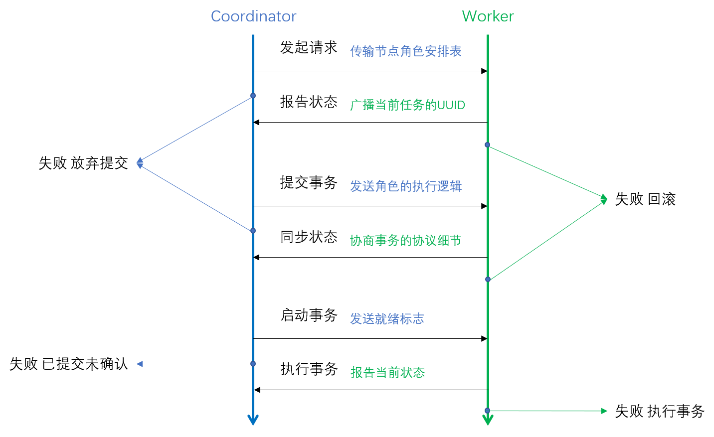
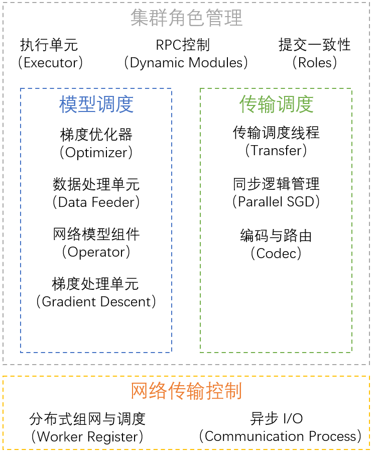

# Parallel SGD

　　Parallel-SGD v0.86  
　　本项目为分布式并行计算框架&简易CPU神经网络模型库。可用于联邦学习和分布式学习中的关于网络架构和通信编码部分的实验，参考ICommunication_Ctrl接口说明（[*Codec&Transfer*](./codec/README.md) ）；可用于神经网络模型分割与模型验证，参考 nn 库使用说明（[*Model&Training*](./nn/README.md)）；可用于分布式并行计算实验，参考 executor 说明（[*Executor&Submit*](./executor/README.md)）。  

## 参数说明

### 工作节点参数
　　所有的参数都通过 job_submit.py 传入，worker节点无需传入任何参数。启动时，使用以下命令启动Worker，无需传入参数。当任务提交时，节点会自动申请并获取工作状态信息。  

```shell script
python worker.py 
```

**注意**：每个worker所在的计算机都需要允许15387端口的TCP传入。  
**注意**：Worker启动后就进入无人值守状态，可以反复提交任务无需重启。  

## 快速上手

　　下面演示一个快速上手执行P-SGD的例程。  

### 模型构建

　　使用自建的nn模块构建模型，使用方法和keras一样简单，下面构建了一个可用于识别MNIST数据集的两层DNN网络结构。  

```python
import nn

model = nn.model.SequentialModel(input_shape=[-1, 784])
model.add(nn.layer.Dense(128, activation=nn.activation.Tanh()))
model.add(nn.layer.Dense(128, activation=nn.activation.Tanh()))
model.add(nn.layer.Dense(10, activation=nn.activation.Softmax()))

model.setup(nn.loss.Cross_Entropy_With_Softmax(), nn.metric.CategoricalAccuracy())
```

调用model.setup()之后，该模型就准备进行P-SGD并行化训练了。可以使用*save*方法保存模型，来保证我们每次训练时的起始状态是一样的。  

```python
import nn

model.save("dnn.model")  # 使用save保存
nn.model.Model.load("dnn.model")  # 使用load加载
```
**附**：详细的模型构建以及nn模块的API说明请参照（[人工神经网络](./nn/README.md)）

### 数据集处理

使用内置的数据集，获取数据集和数据集处理方案。  

```python
from dataset import MNIST
from dataset.transforms import ImageCls, Shuffle

data = MNIST()  # 使用MNIST数据集
trans = Shuffle().add(ImageCls())  # 先对数据集做Shuffle操作，再对数据集进行像素分类处理
```

### 并行化方案

创建并行化方案。  

```python
import executor.psgd as parallel

job = parallel.ParallelSGD(model, data, trans)
```

配置 *worker.json* 如下，并在当前计算机运行一个Worker。  

```json
{
  "Worker": [
    "127.0.0.1"
  ]
}
```

Worker启动后，正常情况下应显示如下内容：  

```shell script
INFO Worker-127.0.0.1@16:01:01 : Working started and ready for job submission.
INFO Worker-127.0.0.1@16:01:02 : Worker started with network type 'FCNet'.
```

选取并行规模，使用特定的Codec执行并行化训练。  

```python
import executor.psgd as parallel

from codec.plain import Plain

nodes = parallel.parse_worker(worker_cnt=1)
job.parallel(nodes, codec=Plain, epoch=10)
```

执行结束后，程序会返回训练好的模型和训练过程中产生的log文件。  
控制台输出应当如下所示：  

```shell script
INFO P-SGD Submit@16:33:09 : Start job.
INFO P-SGD Submit@16:33:09 : Workers: (1) nodes has been assigned:
		-->ID:   0		Address:  127.0.0.1
INFO P-SGD Submit@16:33:11 : Group submission complete ({0}).
INFO P-SGD Submit@16:33:14 : Reply requirements to node(0), type(net_setting).
INFO P-SGD Submit@16:33:14 : Reply requirements to node(0), type(net_model).
INFO P-SGD Submit@16:33:14 : Reply requirements to node(0), type(net_optimizer).
INFO P-SGD Submit@16:33:14 : Reply requirements to node(0), type(net_transfer).
INFO P-SGD Submit@16:33:14 : Reply requirements to node(0), type(data_package).
INFO P-SGD Submit@16:33:14 : Reply requirements to node(0), type(misc_package).
INFO P-SGD Submit@16:33:14 : Node(0) is ready, {0} is ready.
INFO P-SGD Submit@16:33:14 : Dispatch complete.
INFO P-SGD Submit@16:33:14 : Waiting for ({0}) ...
INFO P-SGD Submit@16:35:04 : Restoring data (<Node(0) Reply: All Task is Completed.>) from 0.
INFO P-SGD Submit@16:35:04 : Save file for 0.
	List:
		--> ./Node-0-Retrieve/./tmp_log/Worker-192.168.1.101 2020-10-24 1632.log
		--> ./Node-0-Retrieve/./tmp_log/Fit-0 2020-10-24 1633.log
		--> ./Node-0-Retrieve/TR-P-SGD-N(0).csv
		--> ./Node-0-Retrieve/EV-P-SGD-N(0).csv
		--> ./Node-0-Retrieve/MODEL-P-SGD-N(0).model
INFO P-SGD Submit@16:35:04 : Node(0) is done, {0} is done.
INFO P-SGD Submit@16:35:04 : All task is complete.
```

完整代码如下：  

```python
import nn
import executor.psgd as parallel

from codec.plain import Plain
from dataset import MNIST
from dataset.transforms import ImageCls, Shuffle

model = nn.model.SequentialModel(input_shape=[-1, 784])
model.add(nn.layer.Dense(128, activation=nn.activation.Tanh()))
model.add(nn.layer.Dense(128, activation=nn.activation.Tanh()))
model.add(nn.layer.Dense(10, activation=nn.activation.Softmax()))

model.setup(nn.loss.Cross_Entropy_With_Softmax(), nn.metric.CategoricalAccuracy())

data = MNIST()  # 使用MNIST数据集
trans = Shuffle().add(ImageCls())  # 先对数据集做Shuffle操作，再对数据集进行像素分类处理

job = parallel.ParallelSGD(model, data, trans)
nodes = parallel.parse_worker(worker_cnt=1)

job.parallel(nodes, codec=Plain, epoch=10)
```

### 工作与等待

　　根据控制台的输出，您可以确定已经成功提交任务至多少个节点，当所有节点都准备就绪时，您提交的任务就在集群上正常运行。
当一个Worker已经初始化完成后，会输出相应的信息，以及总共需要初始化的Worker数目，输出如下。
```shell script
INFO P-SGD Submit@08:37:49 : Start job.
INFO P-SGD Submit@08:37:49 : Workers: (9) nodes has been assigned:
		-->ID:  -2		Address:  192.168.1.175
		-->ID:   0		Address:  192.168.1.165
		-->ID:   1		Address:  192.168.1.166
		-->ID:   2		Address:  192.168.1.167
		-->ID:   3		Address:  192.168.1.168
		-->ID:   4		Address:  192.168.1.169
		-->ID:   5		Address:  192.168.1.170
		-->ID:   6		Address:  192.168.1.171
		-->ID:   7		Address:  192.168.1.172
INFO P-SGD Submit@08:37:51 : Single node submission complete.
INFO P-SGD Submit@08:37:51 : Group submission complete ({0, 1, 2, 3, 4, 5, 6, 7}).

 ... ...

INFO P-SGD Submit@08:37:52 : Waiting for ({0, 1, 2, 3, 4, 5, 6, 7, -2}) ...
```
　　当进入Waiting状态时，您可以选择退出Submit进程，当结果计算完成后，使用如下代码便可以取回训练数据。  

```python
import executor.psgd as parallel
import roles
import network

nodes = parallel.parse_worker(worker_cnt=9, ps=True)
req = network.Request()

with req.request(nodes) as com:
    roles.Reclaimer(com).require_client_log()

```

**注意**：.log 文件在训练阶段就可以给出，.csv 报表要在全部训练过程结束之后才能给出。预估您任务的执行时间，来获得完整的数据。  
**注意**：参数服务器只有Worker工作记录和简要的Training日志，没有详细的训练过程报表。  
**注意**：在Sync-SGD强一致性约束下，集群可以保证每个Worker给出的Evaluation报表是一致的。  
**注意**：在ASync-SGD弱一致性约束下，每个Worker给出一个有限的感知范围下最优的Evaluation报表。  


## 详细的`parallel`方法参数定义
```python
from typing import Type, Tuple, Union, Dict, SupportsFloat, Hashable

import codec.interfaces
import network
import nn
import psgd.sync
import psgd.sync.interface
import profiles.blockassignment
import profiles.blockassignment.abstract

def parallel(self,
             nodes: network.NodeAssignment,
             redundancy: int = 1,
             block_size: int = 64,
             epoch: int = 10,
             assignment_type: Type[profiles.blockassignment.abstract.AbsBlockAssignment] = profiles.blockassignment.IIDBlockAssignment,
             sync_type: Type[psgd.sync.interface.IParallelSGD] = psgd.sync.SynchronizedSGD,
             op_type: Type[nn.optimizer.IOptimizer] = nn.optimizer.PSGDOptimizer,
             gd_type: Type[nn.gradient_descent.IGradientDescent] = nn.gradient_descent.ADAMOptimizer,
             codec: Union[Dict[int, Type[codec.interfaces.Codec]], Type[codec.interfaces.Codec]] = None,
             gd_params: Tuple[object] = (),
             ps_codec: Union[Dict[int, Type[codec.interfaces.Codec]], Type[codec.interfaces.Codec], None] = None,
             network_bandwidth: int = 1048576,
             mission_title: str = "P-SGD",
             ssgd_timeout_limit: int = 10000,
             codec_extra_parameters: Dict[Hashable, SupportsFloat] = None):
    """
        执行并行化。
    :param ssgd_timeout_limit: Sync-SGD等待超时限制，单位为毫秒，数值为整型，控制直接相连的Worker之间的最大
                            执行速度差距。如果两个Worker没有直接通讯，则不做限制。例如：连在同一个参数服务器
                            下的两个Worker，由于没有直接通信，则不会限制他们之间的执行速度差异。

    :param network_bandwidth: 可用的网络带宽，用作计算预估传输时间，设置 pre_commit 超时计时器。

    :param mission_title:   任务标题，作为本次任务的log文件文件名。

    :param nodes:           由 network 模块提供的 NodeAssignment 接口，指示了当前并行化操作调用的节点数目。
                            参数服务器的节点编号由 utils.constant.Parameter_Server 指定，其余工作节点的id
                            从 0 开始依次递增（为整数型）。

    :param block_size:      节点粒度的 Batch 大小，由 codec 控制具体的更新策略，块大小与批次大小并没有具体
                            对应关系。若 codec 在每个 Block 后给出结果，则实践意义上 Block size 和 Batch size 
                            是等价的，例如：异步随机梯度下降算法。
                            若 codec 总是等待所有 Block 的训练完成后再同步结果，则实践意义上 Batch size 
                            等于 Block size 乘以 Block 总数，例如：Ring AllReduce SGD。

    :param epoch:           训练批次数，由 codec 和 sync type 共同决定 epoch 内的同步策略，当使用参数服务器
                            时，参数服务器也参与到同步状态的维持中。
                            若 codec 不允许异步执行，则所有节点都会在同一时刻结束 epoch，若 codec 或 sync type 
                            允许跨批次执行，则节点会根据自己的计算能立先后结束计算。

    :param assignment_type: 样本分配策略，一般与冗余分配结合使用，需要实现了 profiles.ISetting 接口的类型。
                            初衷是提供冗余的数据集分配策略，现可以提供静态数据量分配。
                                主要指定一个内容：数据集是如何划分到每个节点上的。

    :param sync_type:       同步方式。分同步和异步两种，需要实现了 psgd.sync.IParallelSGD 接口的类型。
                            同步方式下，每个 worker 在调用 get_weights() 获取权重时才会处理接收数据。
                            异步方式下，每个 Worker 收到数据就处理并更新结果集。
                            具体的数据处理流程和结果集更新策略都由 codec 定义。
                                主要指定一个内容：Worker之间的连接是同步的还是异步的，是否会存在某个worker
                                在运行时突然接收到外部数据。

    :param gd_type:         梯度处理策略类型，实现了 nn.IOptimizer 接口的类型。
                            这里定义了梯度与迭代增量的关系，我们一般不会使用计算出的梯度直接执行反向传播算法，
                            而是对计算出的梯度进行一些处理之后再进行迭代。
                                内置的范式：Adam、RMSProp、AdaDelta、GradientDecay、SGD。
                                主要指定一个内容：如何处理原始梯度，使其更满足模型的需求。

    :param op_type:         梯度生成策略，实现了 nn.gradient_descent.IGradientDescent 接口的类型。
                            这里定义了模型如何对待获取到的更新增量。
                                内置的范式：梯度上升、梯度下降、梯度平均化、并行双重缓冲、参数平均化，联邦学习。
                                主要指定两个内容：1.模型是如何处理更新量\delta w 的，2.模型是如何执行反向传播的。

    :param codec:           编码器类型，实现了 codec.interface.Codec 接口的类型。
                            这个Codec在Worker上运行，用于处理一些编码压缩，稀疏化的操作，这里也定义了
                            Worker要和谁交换数据，如何处理收到的数据。
                                内置的范式：P2P交换网络、中心化交换网络、联邦平均化、动态量化、三值化、随机量化、Adam PS。
                                主要指定两个内容：1.如何处理要发送的梯度，2.发送给谁。

    :param redundancy:      冗余设置，适用于能够处理冗余的 codec 和 block assignment。
                            这个参数会被传递给 @assignment_type，并且要求提供的 @codec 能够处理冗余数据。

    :param gd_params:       梯度生成器参数，传给 @gd_type。

    :param ps_codec:        编码器类型，实现了 codec.interface.Codec 接口的类型。
                            这个Codec在参数服务器上运行，包含了合并全局模型的逻辑。
                                内置的范式：中心化交换网络、联邦平均化、动态量化、三值化、随机量化、Adam PS。
                                主要指定两个内容：1.如何处理全局参数合并，2.如何同步各个Worker的状态。

    :param codec_extra_parameters:用于Codec接口识别的其他参数列表，为字典形式。该字典将会存储在每个Worker的
                            codec.GlobalSettings.__global_parameters 参数中，Codec对象可以使用
                            GlobalSettings.get_params(key: str) -> object 函数获取对应key的值。

    :return: Dict，代表全局执行结果，包含平均准确率和损失，以及在Model中定义的其他评判指标。
    """
    pass
```

## 任务提交 (已弃用)
　　提交任务到集群时，使用 job_submit.py 脚本，脚本参数声明如下：
```shell script
usage: job_submit.py [-h] [--non-iid] -m MODEL_FILE [-n N] [-b B] [-r R]
                     [-C CODEC] [-O OP] [-E EPOCHS] [-D DATASET]
                     [--gradient-descent GD] [--psgd PSGD] [--learn-rate LR]
                     [--block-assignment ASSIGNMENT]
                     [--server-codec SERVER_CODEC] [--workers WORKERS]
                     [--network-bandwidth BANDWIDTH]

optional arguments:
  -h, --help            show this help message and exit
  --non-iid             Set this flag to make the dataset non-iid compatible.
  -m MODEL_FILE, --model MODEL_FILE
                        Model file
  -n N, --node-count N  Worker node count
  -b B, --batch-size B  Batch size
  -r R, --redundancy R  Redundancy
  -C CODEC, --codec CODEC
                        Initial communication codec and protocol {ccdc, plain,
                        ps}
  -O OP, --optimizer OP
                        Set optimizer used for model training.
  -E EPOCHS, --epochs EPOCHS
                        Train epochs
  -D DATASET, --dataset DATASET
                        Dataset in use.
  --gradient-descent GD
                        Gradient optimizing method used in training
  --psgd PSGD           Parallel stochastic gradient descent synchronization
                        type {asgd, ssgd}
  --learn-rate LR       Learining rate
  --block-assignment ASSIGNMENT
                        Block assignment strategy
  --server-codec SERVER_CODEC
                        Server codec for parameter averaging
  --workers WORKERS     Worker list file, json type
  --network-bandwidth BANDWIDTH
                        Network bandwidth in Mbps.
```
* *-h* *--help*  
显示命令使用帮助。  

* *--non-iid*  
使用非 i.i.d. 数据集划分方式对数据集进行分发。  

* *-m* *--model*  
指定要进行分布式并行化的模型文件，模型文件由 *nn.model.Model.save()* 生成。  

* *-n* *--node-count*  
节点数目，当前任务需要占用的节点数目。  
该参数需要与代码适配，在 GlobalSetting 中默认的每个节点编号是连续的且从0开始。  

* *-b* *--batch-size*  
训练批次大小，每个Worker上都以这个迭代规模进行批次迭代训练。  
**注意**：批次在每个节点上是均分的，当冗余设置为 1 倍时，每个节点上的训练样本数目为 *$batch-size* / *$node-count*。  

* *-r* *--redundancy*  
样本冗余份数，当前任务所需的样本冗余份数。  
样本冗余份数会按要求传送给 GlobalSetting ，具体的冗余分配方案仍然依赖 *block_assignment* 参数，当 *block_assignment* 参数提供的处理方法无法处理冗余分配时，设置的冗余级别事实上是无效的。  
**注意**：如果编码控制器无法处理冗余分配情况，可能会导致全局死锁。  

* *-C* *--codec*  
worker上执行的实际编码器。  
需要传入一个编码器参数时，默认给每层都分配相同的编码器。需要传入多个编码器时，使用逗号隔开，每个编码器对应一层，确保层数和编码器数量一致。   
编码器类继承自 codec.interfaces.ICommunicationCtrl 。实现一个编码器类放置在 *job_submit* 可见的 *codec* 文件夹下，当任务提交时，*job_submit* 会自动解析类并发送至Worker上运行。  
**注意**：无需在每个Worker上复制一份 *codec*，*job_submit* 过程会自动将运行所需的代码发送至Worker。  
**注意**：如果编码器引用了外部类或其他依赖，保证这些依赖对每个Worker都是可用的。  
**注意**：第一个编码器参数对应第一个层，以此类推。  
**注意**：当需要引入参数服务器时，确保给定的编码器能与参数服务器正常交互。  
（关于编码器设计的详情，请参阅 [编码控制器教程](./codec/README.md) ）  

* *-O* *--optimizer*  
使用的梯度下降优化器，选用并行梯度下降优化器以实现并行计算。  
    - **Parallel-SGD** （参数："*parallel_sgd*"） 并行梯度下降，Worker之间通过传输梯度来决定迭代方向。
    - **Gradient Averaging** （参数："*gradient_averaging*"） 为带参数服务器的并行算法提供的迭代算法，Worker上传本地计算所得的梯度，Parameter Server 回复给Worker当前的最新模型参数。
    - **Parameter Averaging** （参数："*parameter_averaging*"） 参数平均化方法，Worker之间通过传输模型参数来决定迭代方向。
    - **Double Buffering** （参数："*double_buffering_gradient_averaging*"） 使用一个批次的延迟，换取计算与I/O的并行化，每次更新只发送上一个批次的计算结果。更新策略为梯度传输。

* *-E* *--epochs*  
worker上执行的训练轮次。

* *-D* *--dataset*  
训练所使用的数据集。  
    - **MNIST** （参数："*mnist*"）数据集，
    - **CIFAR-10** （参数："*cifar*"）数据集。   

* *--gradient-descent*  
迭代时使用的梯度优化算法。  
    - **Adaptive Moment Estimation** （参数："*adam*"） 使用ADAM优化算法。
    - **Stochastic Gradient Descent** （参数："*sgd*"） 使用朴素的SGD优化算法
    - **Adaptive Learning Rate Method** （参数："*adadelta*"） 使用AdaDelta优化算法。
    - **Adaptive Gradient Algorithm** （参数："*adagrad*"） 使用AdaGrad优化算法。
    - **Root Mean Square Prop** （参数："*rmsprop*"） 使用RMSProp优化算法。
    - **Gradient Decay** （参数："*decay*"） 使用朴素的学习率衰减SGD算法。

* *--psgd*  
worker上执行的实际SGD同步器。  
asgd 对应异步梯度下降算法，执行异步更新策略，非阻塞立即返回能够获取到的最新权重；ssgd 对应同步梯度下降算法，执行同步更新策略，当且仅当已经和必要节点执行完参数同步后才会释放锁，继续进行训练，ssgd 同样有保底重传策略，当超出SGD 最长同步等待时间后，ssgd 会调用每一层编码器的 ICommunicationCtrl.do_something_to_save_yourself 方法尝试补救，当两次超时并且无法挽回后，ssgd 会报告超时错误。  
    - **Synchronized Stochastic Gradient Descent** （参数："*ssgd*"） 使用强同步约束的并行策略，所有进行直接通讯的Worker之间进度差距不允许大于1批次。
    - **Asynchronous Stochastic Gradient Descent** （参数："*asgd*"） 使用异步约束的并行策略，在任意时刻，Codec必须能够提供可用的计算结果。

* *--learn_rate*  
worker上执行的学习率，当受参数服务器控制更新时，此参数相当于无效。  

* *--block_assignment*  
全局训练样本分配策略。  
继承自 profiles.blockassignment.interfaces.IBlockAssignment ，使用自定义的 block_assignment 分配样本，需要在 server_util.init_model.__assignment_map 中注册。  
本项目的样本被划分为训练集与测试集，样本是固定的。训练集又被划分为多个batch，每个batch被均分为多个block，并发送到 block_assignment 指定的节点上。需要划分为多少个block，以及每个block复制多少份发送给多少节点由block_assignment决定。  
（关于分配策略的详情，请参阅 [分配策略](./profiles/blockassignment/README.md) ）

* *--server_codec*  
参数服务器编码器。  
继承自 codec.interfaces.ICommunicationCtrl ，实现一个编码器并在 server_util.init_model.__para_server_map 中注册，即可在此处传入对应参数，启动对应的参数服务器编码器。

* *--workers*  
工作节点目录，参数内容为文件名，默认为 worker.json。  
在提交任务到集群上之前，需要设置worker.json，标明当前集群的节点列表。
worker.json格式如下：
```json
{
  "PS": "192.168.1.1",
  "Worker": [
    "192.168.1.2",
    "192.168.1.3"  
  ]
}
```
　　主体为一个数组，每行包含两个信息，分别是该节点的工作角色和IP地址，您要保证这些IP地址均可以互相访问。目前支持的角色类型只有两种，"PS"代表该节点以参数服务器的形式工作，"Worker"代表该节点以计算节点的形式工作。   
**注意**：无需在每个节点上配置worker.json，只需要在提交任务时配置了worker.json即可。  

* *--network-bandwidth*  
给出当前环境下的网络传输带宽估计值，用于设置Worker在Commit阶段的超时计时器。  

## 提交流程

　　训练任务的提交过程遵循分布式系统的三阶段提交规范。包含canCommit、preCommit和doCommit三个阶段。
* canCommit阶段：Coordinator会逐个访问worker.json中的每个Worker，检查Worker是否处于可提交阶段。  
    - 当所有的Worker都接收了本次连接并回复ACK之后，进入preCommit阶段。
    - 当存在一个Worker处于Busy状态，或存在一个Worker连接超时，取消提交。
* preCommit阶段：Coordinator会向每个Worker提交本次训练所需的超参数、初始化权重、网络结构和样本集等数据。
    - Worker逐个接收并确认每个Package，当所有的Worker都完成确认之后，进入doCommit阶段。
    - 当存在一个Worker未确认，或超时未确认之后，Coordinator就会放弃提交，断开当前连接。
* doCommit阶段：第一个完成preCommit的Worker会向集群中广播Ready标志。
    - 每个完成preCommit阶段的Worker都会在收到Ready标志后回复Ready_Type，当所有Worker都进入Ready状态后，提交完成。
    - 当超时未收到指定数目的Ready回复后，所有的Worker回退到初始状态并重置连接状态，Coordinator检查连接断开后报告任务提交失败。
    

    
## 一致性约束

　　框架已经不再支持分布式存储，仅保留Codec的只读配置支持。基于目前并行框架的分布式存储 `Executor` 已在构建，在文件夹 `./executor/parallel` 中。

## 框架结构

　　P-SGD的组件关系图如下所示：



## 更新日志

### 0.8

#### 0.87
1. 优化了Logger的缓存机制，将submit_test中benchmark的执行速度提升60%。
2. 删除`job_submit.py`，放弃对0.3版本的支持。

#### 0.86
1. **接口变更**：将 `executor.psgd.ParallelSGD.parallel()` 的返回值从 `Dict[int, Dict[str, SupportsFloat]]` 变更至 `Dict[str, SupportsFloat]`，现在 parallel 方法可以直接返回全局训练结果的平均值，这个更改不会影响生成的文件(`.csv`,`.log`,`.model`)，也不会影响到已有的屏显信息。

#### 0.85
1. 使用线程池重构了BP调度策略，相比0.76版本提升DNN执行速度21.72%，相比0.84版本提升39.64%DNN执行速度。

#### 0.84
1. 增加worker编译脚本。

#### 0.83
1. 将constants移出util包，为以后删除util包做准备。

#### 0.82
1. 提升network模块的吞吐量，简化执行流程和等待机制，多使用协程挂起操作，为异步IO提供良好的调度条件。
2. 提升network模块的吞吐量至 800MB/s，本协议层丢包率0%。

#### 0.81
1. 更新network模块的接口，为以后重构准备。
2. 更新network模块，完善握手断开连接的过程，提供消息送达的保证。
3. 添加强制断开连接的接口，可以放弃未发送的信息。

#### 0.8
1. 更改nn模块的调度器，优化多层神经网络的反向传播过程，提升11.13%CIFAR-NET的运行速度，降低17.23%DNN训练速度。
2. 给出基准指标UT，现在训练MNIST识别网络至93%准确率不超过5秒钟。

### 0.7

#### v0.761
1. Worker现在会始终报告自己的版本。

#### v0.76

1. 支持从 executor.psgd.submit.ParallelSGD.parallel() 函数的 codec_extra_parameters 传入参数，并从每个节点的 GlobalSettings.get_params(key: Hashable) 调出参数。
2. 为不同的Requests设置不同的请求顺序，保证参数类在Codec之前初始化。
