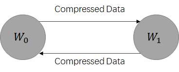
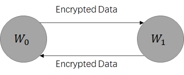
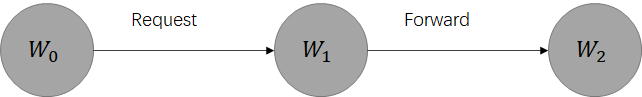
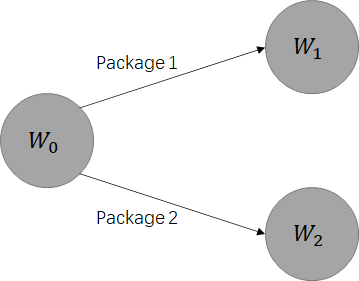
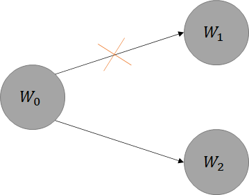

# 教程

　　本段教您如何创建一个 P-SGD 编码传输控制器，P-SGD 编码控制器是 P-SGD 的核心组件，负责控制两个神经网络层（Layer）的参数同步过程。本文创建的编码控制器完整代码在 [tutorial_codec](./tutorial_codec.py) 。  
　　
## 注解

### 关键词
　　文中提到了一些关键词，其对应的含义如下表：

|名字|对应类（实体）|描述|
|----|----|----|
|P-SGD Transfer|psgd.interfaces.ITransfer|与神经网络 Optimizer 直接互操作的接口，包含 put_weights 和 get_weights 方法|
|ISync-SGD|psgd.interfaces.IParallelSGD|P-SGD Transfer 中的子控制器，每个 ISync-SGD 掌管着一个权重参数的分布式交互策略|
|Async-SGD|psgd.asgd.AsynchronizedSGD|ISync-SGD 的一个实现，使用异步策略执行节点之间的数据更新|

### 文献
　　关于 Async-SGD 的其他细节，请参考文献：  
　　Recht, Benjamin and Re, Christopher and Wright, Stephen and Feng Niu. Hogwild: A Lock-Free Approach to Parallelizing Stochastic Gradient Descent. Advances in Neural Information Processing Systems (NIPS). Curran Associates, Inc. 2011.

### Warning

　　**注意**：本测试器只测试类的完整性，并不会测试编码过程的统计有效性，您需要使用数学证明来确认您的编码过程是完整有效的。

## 接口

　　编码控制器继承自 codec.interfaces.ICommunication_Ctrl 抽象类，当需要创建新的编码控制器时，需要继承自抽象类，抽象类负责了参数提交与更新的判断。P-SGD Transfer保证了对编码器的调用是串行化的，所以无需在编码控制器中考虑并行因素的影响。  
　　运行以下代码导入编码控制器抽象。

```python
from codec.interfaces import Codec
```

## 参数

　　编码控制器总是需要接受一个 node_id 来创建，当需要创建编码控制器时，P-SGD Transfer 会创建编码控制器并给一个 node_id 的参数，代表了当前节点在集群中的唯一识别编号。  
　　您可以选择接受并记录该参数，也可以选择抛弃该参数，该参数只会在创建的时候传递，之后也没有与该参数关联的接口，无需做过多的处理。

```python
from codec.interfaces import Codec

class myComCtrl(Codec):
    def __init__(self, node_id):
        super().__init__()
        # save it if you need it
        self.__node_id = node_id
```

## 处理资源释放

　　当 P-SGD Transfer 终止一个编码控制器的生命周期时，调用 dispose() 接口执行释放，需要在您的类中实现该接口以正确配置资源释放。

```python
from codec.interfaces import Codec

class myComCtrl(Codec):
    def __init__(self, node_id):
        super().__init__()
        # save it if you need it
        self.__node_id = node_id
    
    def dispose(self):
        print('my communication controller is disposed.')
```

## 处理数据

　　现在我们已经配置好了对象的构造与释放方法，下面就可以实现核心内容了，即如何处理数据。发送给编码控制器的数据总是有两个来源，一个是由本机提交，另一个是从其他计算节点获取，分别对应两个接口：update_blocks(self, block_weight) 和 receive_blocks(self, json_dict)。  

### 数据的提交

　　当本机提交计算完成的权重时，P-SGD Transfer 会将事件转发给对应层的编码控制器，其中 block_weight 是 codec.essential.Block_Weight 的对象，保存了本机能够获取到的与该参数关联的信息。其中有：  

| 成员 | 类型 | 注释 |
| ---- | ---- | ---- |
| Layer_ID | int | 本参数的层编号 |
|Batch_ID|int|本参数的批次编号|
|Block_ID|int|本参数的样本Block编号|
|Company_ID|sequence|本参数对应的样本Block还在哪些节点上出现过|
|Adversary_ID|sequence|本参数对应的样本Block没在哪些节点上出现过|
|Content|numpy.ndarray|参数本身|

**注意**：传入的参数默认是权重梯度而不是权重，要使用参数更新机制，需要更换 P-SGD Optimizer，Optimizer 可在 server_util.init_model.__optimizer_map 中找到。  

　　下面的代码接收了梯度平均化方法的参数提交：
```python
from codec.interfaces import Codec
from codec.essential import BlockWeight

class myComCtrl(Codec):
    def __init__(self, node_id):
        super().__init__()
        # save it if you need it
        self.__node_id = node_id
    
    def dispose(self):
        print('my communication controller is disposed.')

    def update_blocks(self, block_weight:BlockWeight):
        print('Weights delta received.')
        print('from block: {}'.format(block_weight.block_id))
        print('has content: {}'.format(block_weight.content))
```

　　当您需要将数据发送到网络上时，您需要几个特别的参数。首先，您需要知道您的数据要送给哪些节点。要获取全局已申请的节点编号，调用以下代码：
```python
from profiles.settings import GlobalSettings

print('Workers in current job: {}'.format(GlobalSettings.get_default().nodes))
```
 
　　要将您的数据返回给 P-SGD Transfer 处理，您还需要将其封装成 netEncapsulation 对象。依照梯度平均化编码控制器的任务提交逻辑，应当将本节点计算所得的梯度传输给参数服务器或其他没有该数据的执行节点，我们先实现一个无参数服务器的简单模型，代码如下：  

```python
from codec.interfaces import Codec
from codec.essential import BlockWeight
from codec.interfaces import netEncapsulation

class myComCtrl(Codec):
    def __init__(self, node_id):
        super().__init__()
        # save it if you need it
        self.__node_id = node_id
    
    def dispose(self):
        print('my communication controller is disposed.')

    def update_blocks(self, block_weight:BlockWeight):
        print('Weights delta received.')
        print('from block: {}'.format(block_weight.block_id))
        print('has content: {}'.format(block_weight.content))
        
        send_to = block_weight.adversary
        pkg = {
            'data': block_weight.content
        }
        
        yield netEncapsulation(send_to, pkg)
```
**注意**：在打包时应当发送可被序列化的 python 或 numpy 类型，不应当发送自定义类型，如果要发送自定义类型，请保证该类型是可序列化的，且对每个Worker都是可见的。   
**注意**：update_block 和 receive_blocks 都返回迭代器对象，当有多个数据包需要发送的时候，使用 yield 逐个生成，当无数据包需要发送的时候，可以返回 None。

　　至此，我们就完成了将数据送至网络的过程，生成好数据包后，您的数据包会被 ISync-SGD获取并进行时效性编号，并交由 P-SGD Transfer 进行转发，P-SGD Transfer 获取并将数据包放置到ICommunication_Control 的发送队列，当发送连接可用时，您的数据会被序列化并发送给指定的节点。

### 数据的接收

　　当接收到其他工作节点的数据时，P-SGD Transfer 会将事件转发给对应的编码器控制层，由 ISync-SGD 决定是否将该事件转发给编码控制器，SSGD 会将数据保留直到下一次全局更新开始时才会将数据转发给编码控制器，ASGD 则会在每次数据到达时直接将数据转发给编码控制器。选择合适的 ISync-SGD 类型，使得您的编码控制器能够有效的运作。（参考 [主页](../README.md)了解如何从参数配置 SGD-Type）  
　　当您完成一批数据的处理时，调用 set_result 方法来提交您的结果，当神经网络端需要更新权值时，会调用 get_result 方法直接获取数据，如果获取不到数据则会进行超时计数，超过一个SynchronizedSGD.INT_READ_TIMEOUT_MS 周期后，ISync-SGD 会尝试调用编码器的do_something_to_save_yourself 方法试图恢复集群的稳定状态，当超出两个 SynchronizedSGD.INT_READ_TIMEOUT_MS 周期后，P-SGD Transfer 就会报告超时错误，与集群的连接就会断开。  
　　当有消息需要处理时，P-SGD Transfer 会调用 receive_blocks 方法，实现该方法并与您的 update_blocks 匹配，就可以完成一次任务的转发。要注意的是，节点不一定会在接收消息的时候完成参数的归一，可能会有其他比较快的计算节点抢先完成计算，本节点在自己计算完成并提交之后才完成参数的归一，因此我们要在参数提交和参数接收两个方法中都定义归一操作。利用全局节点总数来判断我们是否需要进行梯度平均化操作，实现如下：  
```python
from codec.interfaces import Codec
from codec.essential import BlockWeight
from codec.interfaces import netEncapsulation

from profiles.settings import GlobalSettings


class myComCtrl(Codec):
    def __init__(self, node_id):
        super().__init__()
        # 保存并记录本节点编号信息，除此之外再也没有其他地方可以获取该信息
        self.__node_id = node_id
        # 保存并记录当前批次已经收到了多少份结果
        self.__global_weights = 0
        self.__current_recv = 0

    def __do_grad_average(self):
        how_much_nodes = GlobalSettings.get_default().node_count
        if self.__current_recv == how_much_nodes:
            # 执行梯度平均
            self.set_result(self.__global_weights / how_much_nodes)
            # 重设梯度值，等待下一批次的循环
            self.__global_weights = 0
            self.__current_recv = 0
```
**注意**：*set_result()* 方法调用时会将结果累加起来，本次调用传入的值会和上次剩余的值累加，而不是覆盖。  


　　如果当前的节点工作的比其他节点快，那么当前节点就会在接收到其他节点发来的消息时完成梯度平均化，如果当前的节点工作的比其他节点慢，那么当前节点需要在完成本地更新之后完成梯度平均化。因此我们在 update_blocks 方法和 receive_blocks 方法中都调用了梯度平均化判断。  
　　完整的代码如下：

```python
from codec.interfaces import Codec
from codec.essential import BlockWeight
from codec.interfaces import netEncapsulation

from profiles.settings import GlobalSettings


class myComCtrl(Codec):
    def __init__(self, node_id):
        super().__init__()
        # 保存并记录本节点编号信息，除此之外再也没有其他地方可以获取该信息
        self.__node_id = node_id
        self.__global_weights = 0
        self.__current_recv = 0
    
    def dispose(self):
        print('my communication controller is disposed.')

    def update_blocks(self, block_weight:BlockWeight):
        print('Weights delta received.')
        print('from block: {}'.format(block_weight.block_id))
        print('It has a content with shape: {}'.format(block_weight.content.shape))
        
        # 获取没有该数据的节点
        send_to = block_weight.adversary
        # 我们使用 'data' 字符串来标记我们的梯度内容
        pkg = {
            'data': block_weight.content
        }
        # 记录本机梯度
        self.__global_weights += block_weight.content
        self.__current_recv += 1
        # 检查是否接受完所有数据
        self.__do_grad_average()
        # 发送梯度
        yield netEncapsulation(send_to, pkg)

    def receive_blocks(self, json_dict:dict):
        print('I have received an package.')
        print('It has a content with shape: {}'.format(json_dict['data'].shape))
        # 我们使用上述定义的 'data' 字符串获取我们更新的梯度内容
        self.__global_weights += json_dict['data']
        # 记录已经接收到多少个梯度了
        self.__current_recv += 1
        # 检查是否接受完所有数据
        self.__do_grad_average()
        
    def __do_grad_average(self):
        how_much_nodes = GlobalSettings.get_default().node_count
        if self.__current_recv == how_much_nodes:
            # 执行梯度平均
            self.set_result(self.__global_weights / how_much_nodes)
            # 重设梯度值，等待下一批次的循环
            self.__global_weights = 0
            self.__current_recv = 0
```

**注意**：在 Async-SGD 执行模式下，数据的产生与接收是异步的，update_blocks 与 receive_blocks方法可能会同时被不同的线程调用，需要额外考虑数据的线程安全性。  
**注意**：receive_blocks 方法中同样可以使用 yield netEncapsulation() 来发送数据，您可以借助这种形式实现数据包的二次加工和转发。


## 调试

　　完成了编码控制器的编写后，我们需要对编码控制器进行 DEBUG，直接将其放入分布式集群进行测试肯定不是一个好的选择。codec.test_codec 中提供了不同类型的自动化测试脚本，在上述教程中我们编写了一个梯度平均化编码控制器，且不使用参数服务器，那么现在使用codec.test_codec.p2p_test_script.py 执行一下编码控制器的测试。  
　　找到测试脚本的第 11-22 行，用我们编写的编码控制器替换掉原有的配置，使用您的IDE进行DEBUG 或 RUN 该脚本，如果未出现错误，则证明该编码控制器在同步环境下是可用的。（注意：异步环境下的线程安全性问题比较隐蔽且难以探查，需要异步编码控制器时您应当反复检查其线程安全性，不安全的代码可能会导致意想不到的效果）  
　　假设我们的编码控制器配置在文件 codec.tutorial_codec.py 中，要修改的内容如下：

```python
# more codes upon .......

"""
    ---------------DEFINE HERE---------------
"""
# import test codec
from codec.tutorial_codec import myComCtrl
from profiles.blockassignment.duplicate import DuplicateAssignment
# Type
SLAVE_CODEC = myComCtrl
ASSIGNMENTS = DuplicateAssignment
"""
    ---------------DEFINE HERE---------------
"""

# more codes below ......
```

## 部署

### 部署 Worker
　　当调试完成且没有错误时，我们就可以将编码控制器部署至集群正式运行了。在可以直接互相访问的计算机上启动我们的Worker。执行以下语句：  
```shell script
python worker.py
```
### 配置 Cluster
　　记录这些Worker在同一网段内的ip地址，写入一个worker.json。假设我们的ip配置如下：
```json
[
  ["Worker", "192.168.1.2"],
  ["Worker", "192.168.1.3"]
]
```
　　通过上述配置，我们将ip为*192.168.1.2*和*192.168.1.3*两台计算机配置为Worker节点。
### 提交任务
　　将 *worker.json* 和 *job_submit.py* 放置到同一个目录，使用以下命令以默认数据集（MNIST数据集）和网络结构（Multi-Layer Perceptron）启动我们的训练集群。（假设我们新建的编码控制器在目录 *./codec/tutorial_codec.py* 中）
　　
```shell script
python job_submit.py --codec tutorial_codec.myComCtrl --node_count 2
```
　　至此，我们已经成功提交myComCtrl至集群上运行了。job_submit不会实时展示结果，要实时查看结果，可以查看worker端的控制台或worker端的log文件（在./tmp_log/目录下），当任务执行完成后，job_submit会取回log文件和训练记录csv文件，csv文件保存在根目录，log文件保存在 ./tmp_log/ 目录。  
**注意**：您需要及时收集训练信息，未收集的训练信息可能会被覆盖。  
　　执行后的输出如下所示，您也可以在 ./tmp_log/ 文件夹下找到前缀为 User Submit 的log记录。
```shell script
INFO User Submit@16:53:29 : 	 --node_count <node count 2>
INFO User Submit@16:53:29 : 	 --batch_size <batch size 64>
INFO User Submit@16:53:29 : 	 --redundancy <r 1>
INFO User Submit@16:53:29 : 	 --codec <communication codec and protocol tutorial_codec.myComCtrl>
INFO User Submit@16:53:29 : 	 --optimizer <optimizer for model training psgd>
INFO User Submit@16:53:29 : 	 --psgd <parallel stochastic gradient descent synchronization type ssgd>
INFO User Submit@16:53:29 : 	 --learn_rate <learn rate for GD algorithm 0.05>
INFO User Submit@16:53:29 : 	 --epochs <training epochs 1>
INFO User Submit@16:53:29 : 	 --block_assignment <block assignment strategy iid>
INFO User Submit@16:53:29 : 	 --server_codec <parameter server codec sgq>
INFO User Submit@16:53:29 : Add worker (Rule: Worker, Id: 0, Address: 192.168.1.2).
INFO User Submit@16:53:29 : Add worker (Rule: Worker, Id: 1, Address: 192.168.1.3).
INFO User Submit@16:53:29 : Try connecting to the cluster.
INFO User Submit@16:53:31 : Connection with cluster established.
INFO User Submit@16:53:33 : Reply requirements to node(0), type(global_setting_package).
INFO User Submit@16:53:33 : Reply requirements to node(1), type(global_setting_package).
INFO User Submit@16:53:33 : Reply requirements to node(0), type(codec_and_sgd_package).
INFO User Submit@16:53:33 : Reply requirements to node(1), type(codec_and_sgd_package).
INFO User Submit@16:53:33 : Reply requirements to node(0), type(weights_and_layers_package).
INFO User Submit@16:53:33 : Reply requirements to node(1), type(weights_and_layers_package).
INFO User Submit@16:53:33 : Reply requirements to node(0), type(misc_package).
INFO User Submit@16:53:33 : Reply requirements to node(0), type(data_sample_package).
INFO User Submit@16:53:36 : Reply requirements to node(1), type(misc_package).
INFO User Submit@16:53:38 : Reply requirements to node(1), type(data_sample_package).
INFO User Submit@16:53:43 : Node(0) is ready, 2 nodes total, {0} is ready.
INFO User Submit@16:54:15 : Node(1) is ready, 2 nodes total, {0, 1} is ready.
INFO User Submit@16:54:48 : Restoring data (T-N(2)-R(1)-ID(0)-CODEC(mmmmmm).csv) from 0.
INFO User Submit@16:54:48 : Restoring data (E-N(2)-R(1)-ID(0)-CODEC(mmmmmm).csv) from 0.
INFO User Submit@16:54:48 : Restoring data (./tmp_log/Training log @ node-0_16-53-33.log) from 0.
INFO User Submit@16:54:49 : Restoring data (T-N(2)-R(1)-ID(1)-CODEC(mmmmmm).csv) from 1.
INFO User Submit@16:54:49 : Restoring data (E-N(2)-R(1)-ID(1)-CODEC(mmmmmm).csv) from 1.
INFO User Submit@16:54:49 : Restoring data (./tmp_log/Training log @ node-1_16-53-37.log) from 1.
Connection with worker (id: 0, address: ('192.168.1.2', 15387)) has been lost.
Connection with worker (id: 1, address: ('192.168.1.3', 15387)) has been lost. 
```

## 其他
　　关于分配策略（IBlockAssignment）的详情，请参阅 [分配策略](../profiles/blockassignment/README.md)。

　　编码控制器仅需要控制一层网络的权重交互，P-SGD Worker 在初始化运行环境之前会为每个神经网络层的每个参数创建一个编码控制器，P-SGD Transfer 会保证每个编码控制器接收到的权重总是来自同一个神经网络层（无论这段数据是来源于本机还是其他 Worker，P-SGD Transfer总是保证将其转发给唯一的编码控制器）。  
　　通过更改每个节点发送数据的目的地，可以实现改变整个P-SGD网络的通信模式。通过对通信过程中的数据包进行编解码操作，可以改变数据传输的编码形式。无论是在接收数据还是在发送数据，框架都会检查ICommunication_Ctrl是否有需要传递的数据，因此可以实现节点对数据的路由和转发，进而实现P-SGD下的SDN网络，进一步提高实验的灵活性。  
　　基于编码控制器的数据管控和目标定向功能，可以实现类似通信链路协议和SDN网络两层功能。  
　　在数据控制方面，可以实现：
* 数据压缩  

* 数据加密  


　　在SDN角度，可以实现：
* 数据转发  

* 数据选择  

* 数据阻塞  


